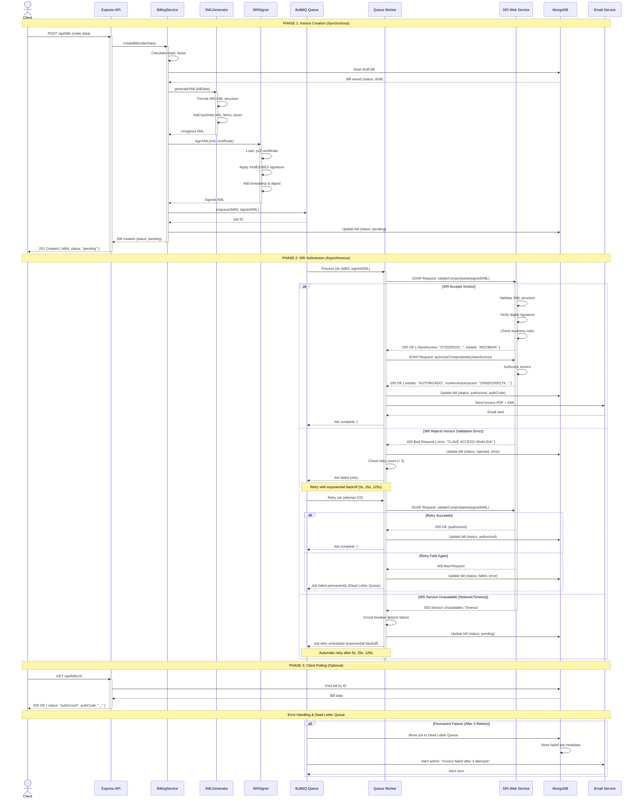

# SRI Electronic Invoice Flow - Sequence Diagram

This diagram shows the complete flow for generating and submitting electronic invoices to SRI (Servicio de Rentas Internas) Ecuador.

## Flow Diagram



## Flow Description

### Phase 1: Invoice Creation (Synchronous)
1. **Client Request**: POS/frontend sends order data to REST API
2. **Bill Creation**: `BillingService` creates a draft bill with calculated totals and taxes
3. **XML Generation**: `XMLGenerator` formats data into SRI-compliant XML structure
4. **Digital Signature**: `SRISigner` signs XML using .p12 certificate (XAdES-BES standard)
5. **Queue Enqueue**: Signed XML is added to BullMQ job queue
6. **Database Update**: Bill status updated to "pending"
7. **API Response**: Client receives immediate response (bill created, submission in progress)

### Phase 2: SRI Submission (Asynchronous - Background Worker)
8. **Worker Processes Job**: BullMQ worker picks up job from queue
9. **SOAP Validation**: Send `validarComprobante` request to SRI
10. **SRI Validation**: SRI validates XML structure, signature, and business rules
11. **Authorization Request**: If valid, send `autorizarComprobante` to get authorization code
12. **Success Path**:
    - SRI returns 37-digit authorization code
    - Update bill status to "authorized" in database
    - Send email with PDF + XML to customer
    - Mark job as complete
13. **Rejection Path**:
    - SRI returns validation error (e.g., invalid RUC, wrong tax calculation)
    - Update bill status to "rejected"
    - Retry job with exponential backoff (max 3 attempts)
14. **Network Failure Path**:
    - SRI timeout or 503 error
    - Circuit breaker prevents cascading failures
    - Automatic retry after delay (5s → 25s → 125s)

### Phase 3: Client Polling
15. **Status Check**: Client polls `GET /api/bills/:id` to check invoice status
16. **Final Status**: Returns "authorized" with auth code, or "rejected"/"failed" with error

## Retry Strategy

| Scenario | Action | Max Retries | Backoff |
|----------|--------|-------------|---------|
| **Validation Error** (400) | Retry in case of transient SRI bug | 3 | 5s, 25s, 125s |
| **Network Timeout** | Retry (SRI may be slow) | 3 | 5s, 25s, 125s |
| **Service Unavailable** (503) | Retry (SRI maintenance) | 3 | 5s, 25s, 125s |
| **Certificate Error** | No retry (human intervention needed) | 0 | - |
| **Wrong XML Structure** | No retry (fix code, resubmit) | 0 | - |

After 3 failed attempts, the job moves to the **Dead Letter Queue** for manual review.

## Circuit Breaker Behavior

If SRI is completely down (e.g., 5 consecutive failures):
1. Circuit breaker opens (stops sending requests to SRI)
2. New jobs accumulate in queue
3. Circuit breaker enters "half-open" after 60 seconds
4. Allows 1 test request through
5. If successful → circuit closes, resume processing
6. If failed → circuit remains open for another 60 seconds

This prevents overwhelming SRI when it's recovering from an outage.

## Key Components

| Component | Responsibility | Location |
|-----------|----------------|----------|
| **BillingService** | Business logic, totals calculation | `src/application/services/BillingService.ts` |
| **XMLGenerator** | Generate SRI-compliant XML | `src/infrastructure/services/sri/XMLGenerator.ts` |
| **SRISigner** | XAdES-BES digital signature | `src/infrastructure/services/sri/SRISigner.ts` |
| **BullMQ Queue** | Job queue with Redis persistence | `src/infrastructure/queue/BullMQInvoiceQueue.ts` |
| **SRI Client** | SOAP client with retry/circuit breaker | `src/infrastructure/services/sri/SRIClient.ts` |
| **Email Service** | Send PDF + XML to customer | `src/infrastructure/services/EmailService.ts` |

## Environment Variables

```bash
# SRI Configuration
SRI_ENV=1                          # 1=Test, 2=Production
SRI_SIGNATURE_PATH=./certs/firma.p12
SRI_SIGNATURE_PASSWORD=secret

# Business Identification
RUC=1234567890001
ESTAB=001
PTO_EMI=001

# Queue (Production)
REDIS_HOST=localhost
REDIS_PORT=6379
REDIS_PASSWORD=optional
```

## Error Examples

### Validation Error (Rejected by SRI)
```xml
<mensajesList>
  <mensaje>
    <identificador>35</identificador>
    <mensaje>CLAVE DE ACCESO REGISTRADA</mensaje>
    <tipo>ERROR</tipo>
  </mensaje>
</mensajesList>
```

### Network Timeout
```
Error: ETIMEDOUT - SRI web service did not respond within 30 seconds
```

### Authorization Success
```xml
<autorizacion>
  <estado>AUTORIZADO</estado>
  <numeroAutorizacion>2506202500179123456789012345678901</numeroAutorizacion>
  <fechaAutorizacion>25/06/2025 14:32:15</fechaAutorizacion>
</autorizacion>
```

## References

- [SRI Official Documentation](https://www.sri.gob.ec/facturacion-electronica)
- [ADR-003: SRI Integration](../adr/ADR-003-sri-integration.md)
- [ADR-004: BullMQ Queue](../adr/ADR-004-queue-bullmq.md)
- `src/infrastructure/services/sri/` - SRI implementation
- `src/infrastructure/queue/` - Queue implementation
